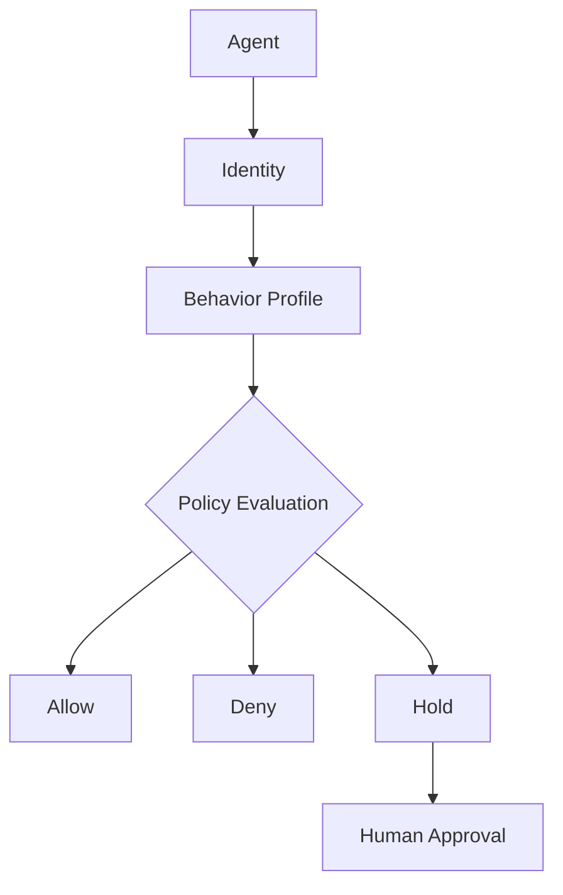

# AGP Community Edition

AGP (Agent Governance Plane) is **runtime enforcement infrastructure that sits between your AI agents and every MCP tool they can invoke.** It is not an SDK, a prompt, or a convention the agent can choose to follow — it is a governance plane the agent cannot route around. Every call passes through an enforcement point your agents can't bypass, and no call reaches a tool backend unless AGP has authenticated the agent, checked its approved operating envelope, evaluated policy, and made an explicit decision to allow it.

**Community Edition** runs entirely on your machine: single static binaries, state in SQLite under `~/.agp`, zero external infrastructure, no telemetry. It is free to use, with no caps on agents, tools, or users.

:::tip New to the *why*?
This guide is the hands-on path. For the architecture and threat model behind it, see [AGP Overview](../architecture/agp-overview) and [Operational Safety](../concepts/operational-safety).
:::

## The mental model

Every tool call your agent makes passes through four questions — answered at runtime, on **every** call:

1. **Who is this agent?** — The proxy authenticates a short-lived token issued by Identity. There are no shared credentials and no anonymous agents.
2. **Is this tool in its envelope?** — The agent's **Behavior Profile** determines which tools it can see and call. Tools that are not explicitly granted simply do not exist from the agent's perspective. This is deny-by-default.
3. **What does policy say?** — The registry records facts about each tool (`read`, `write`, `delete`, `execute`). **Policy** evaluates those facts and decides whether the operation should be allowed, denied, or held for approval.
4. **What is the decision?** AGP returns one of three outcomes:

- `allow` — execute immediately

- `deny` — reject the request

- `hold` — pause and wait for human approval

Every decision — allow, deny, or hold — is recorded in an append-only audit trail. Administrative actions such as profile changes, policy updates, tool registrations, and approval decisions are recorded as well.

The result is a complete history of who did what, when, and why.

The path every call takes:



## What you'll set up

By the end of the Get Started guide you will have:

- The full AGP stack running locally (8 services + console), health-checked.
- The **admin console** open in your browser.
- Your **first governed agent**, connected to an MCP client (Claude Desktop, Claude Code, Cursor, VS Code, or Codex).
- A working understanding of why that agent starts out seeing **zero** tools — and how to grant it the ones it needs.

## Prerequisites

- macOS, Linux, or Windows (arm64 or amd64).
- About 5 minutes. No Docker, no database, no cloud account.

## The five-command tour

The whole happy path is five commands. The pages that follow walk through each one in detail.

```sh
agp init          # 1. create ~/.agp: secrets, per-service config, CLI profile
agp fetch all     # 2. download the service binaries for your platform
agp start all     # 3. start the stack (health-checked) — console at :27868
agp status        # 4. confirm every service is running and ready
agp setup         # 5. create your first agent + connect a client
```

Start with [Install &amp; first run →](install)
